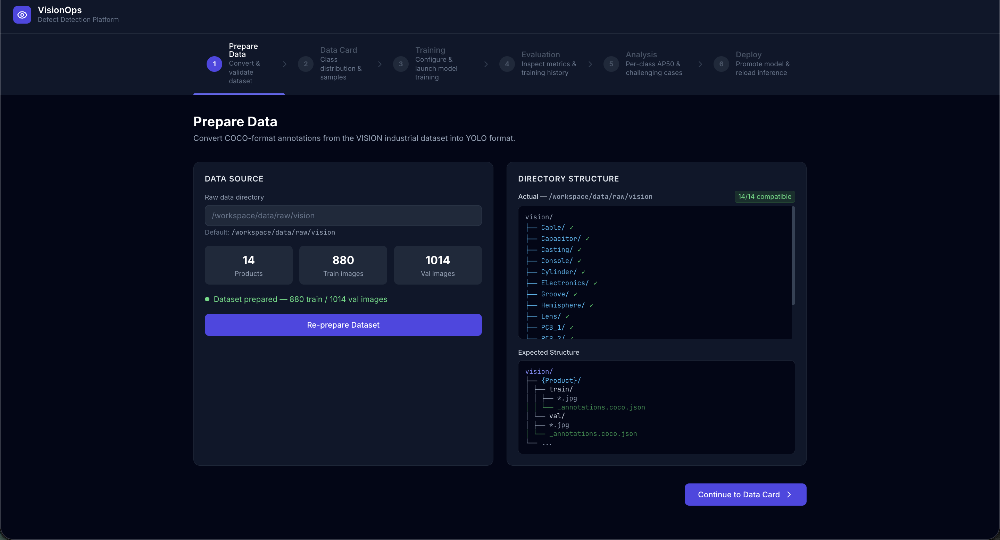
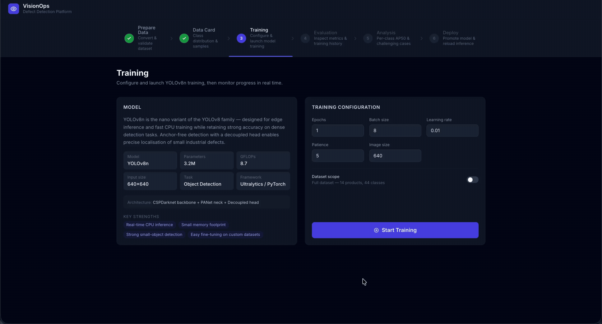
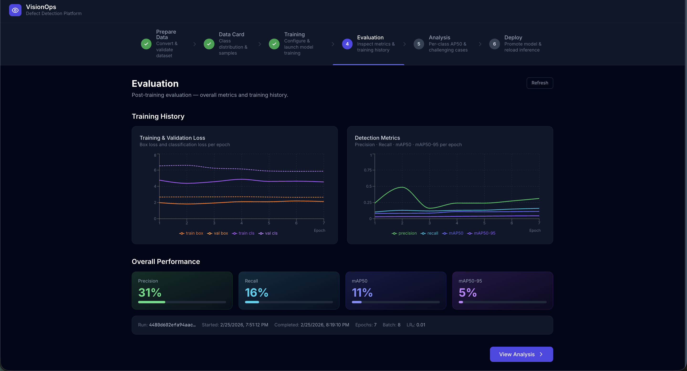

# visionops-defect-detection

An end-to-end MLOps platform for industrial defect detection using the [VISION dataset](https://huggingface.co/datasets/VISION-Workshop/VISION-Datasets). Demonstrates production engineering patterns across two workflows: a **browser-based Platform UI** and an **Airflow DAG pipeline**.

---

## Repository Structure

```
visionops-defect-detection/
├── .github/workflows/      # CI: lint + docker build
├── configs/                # YAML configs (model, training, drift thresholds)
├── dags/                   # Airflow DAGs
├── data/
│   ├── raw/vision/         # Dataset (not committed — .gitkeep)
│   ├── processed/          # YOLO-format annotations
│   └── drift_batches/      # Simulated drift data
├── docker/                 # Dockerfiles + inference requirements
├── platform/
│   ├── backend/            # FastAPI platform API (port 8001)
│   ├── frontend/           # React + TypeScript UI (port 3001)
│   └── docker-compose.yml  # Platform service definitions
├── resources/              # README screenshots and GIFs
├── src/
│   ├── data/               # prepare_dataset, drift_simulator
│   ├── features/           # Feature extraction utilities
│   ├── training/           # YOLOv8n training + MLflow logging
│   ├── inference/          # FastAPI inference service
│   └── monitoring/         # Evidently drift detection
└── tests/                  # pytest test suite
```

---

## Setup

### Prerequisites

- Python 3.11+
- Docker Desktop

### 1. Clone and create an environment

```bash
git clone https://github.com/moseskim1027/visionops-defect-detection.git
cd visionops-defect-detection
```

**Option A — venv:**
```bash
make venv
source .venv/bin/activate
```

**Option B — conda:**
```bash
make conda-env
conda activate visionops
```

### 2. Install dependencies

```bash
make install
```

### 3. Download the VISION dataset

Download from [HuggingFace](https://huggingface.co/datasets/VISION-Workshop/VISION-Datasets) and extract to `data/raw/vision/`. The directory should contain product subdirectories (e.g. `Casting/`, `Console/`) each with `train/` and `val/` image folders and COCO-format annotation files.

### 4. Prepare the dataset

Converts COCO annotations to YOLO format and writes a `dataset.yaml`:

```bash
make data
```

---

## Dataset

The [VISION dataset](https://huggingface.co/datasets/VISION-Workshop/VISION-Datasets) is an industrial defect detection benchmark covering 44 defect classes across 14 product categories (Casting, PCB, Capsule, Console, etc.) with 1,894 images in COCO format. Training on the full dataset takes ~30 min on CPU; a 4-product subset (Casting, Console, Groove, Ring) runs in ~5 min.

---

## Platform UI

`platform/` is a browser-based MLOps UI that wraps the full pipeline in a six-step interface. It runs on top of the base inference stack.

### Starting the stack

**Step 1 — Build and start the base stack** (MLflow, inference, Prometheus, Grafana):

```bash
docker compose up --build -d
docker compose ps   # wait until mlflow and inference show "(healthy)"
```

| Service | URL | Purpose |
|---|---|---|
| mlflow | http://localhost:5001 | Experiment tracking + model registry |
| inference | http://localhost:8000 | FastAPI + Prometheus metrics |
| prometheus | http://localhost:9090 | Scrapes inference every 15 s |
| grafana | http://localhost:3000 | Dashboards (anonymous access) |

**Step 2 — Build and start the platform** (backend API + React frontend):

```bash
docker compose -f platform/docker-compose.yml up --build -d
```

| Service | URL |
|---|---|
| Platform UI | http://localhost:3001 |
| Platform API | http://localhost:8001 |

---

### Step 1 — Prepare Data

Browse the raw dataset directory tree, then trigger COCO → YOLO conversion in one click. Live status polling shows preparation progress; on completion an annotated sample grid appears with OpenCV-drawn bounding boxes and per-class colour coding.



---

### Step 2 — Data Card

Explore the class distribution as an interactive bar chart. Click any class to filter the ground-truth annotation panel; click any image to expand in a full-screen lightbox with keyboard navigation.


---

### Step 3 — Training

Review the YOLOv8n architecture overview, configure hyperparameters (epochs, batch size, learning rate, patience, image size) and optionally select a product subset for faster iteration. Start training and watch live epoch-by-epoch metrics (mAP50, Precision, Recall, box/cls losses) update as each epoch completes.



---

### Step 4 — Evaluation

Review training history charts — loss curves (train/val box + cls) and detection metrics (Precision · Recall · mAP50 · mAP50-95) plotted per epoch — alongside final metric tiles pulled from MLflow.



---

### Step 5 — Analysis

Per-class AP50 bar chart colour-coded by threshold (≥ 70% green · 40–70% amber · < 40% red), powered by `model.val()`. Click any class to filter the challenging-cases grid on the right. Ground-truth (green) and predicted (orange) bounding boxes are overlaid on each image; click to expand in a lightbox.


---

### Step 6 — Deploy

View all registered model versions with their MLflow run metrics. Promote any version to the `production` alias, then reload the inference service to deploy it. A Grafana quick-link opens the live request-rate, latency, and error-rate dashboard.


---

### Stopping the platform

```bash
docker compose -f platform/docker-compose.yml down   # stop platform only
docker compose down                                   # stop base stack
docker compose down -v                                # also remove volumes
```

---

### Local development (no Docker)

```bash
# Terminal 1 — backend
cd platform/backend
pip install -r requirements.txt
ROOT_DIR=$(pwd)/../.. uvicorn app.main:app --reload --port 8001

# Terminal 2 — frontend
cd platform/frontend
npm install
npm run dev   # http://localhost:3001
```

---

## Airflow DAGs

The Airflow stack runs on top of the base stack and automates training and drift monitoring with no additional tools beyond Docker.

### Starting the Airflow stack

```bash
make airflow-up   # starts base stack + Airflow services (~60 s to become healthy)
```

| Service | URL | Credentials |
|---|---|---|
| Airflow UI | http://localhost:8080 | admin / admin |

```bash
make airflow-down    # stop containers, keep volumes
make airflow-down-v  # stop containers and delete volumes
```

### `training_pipeline`

Validates the dataset, trains YOLOv8n, registers the model in MLflow, and conditionally promotes it to the `production` alias if `map50` meets the threshold defined in `configs/model.yaml`.

```
validate_data → train_model → register_model → conditional_promote
                                                      │
                                        ┌─────────────┴──────────────┐
                                  promote_model               skip_promotion
```

Trigger from the Airflow UI (**training_pipeline → Trigger DAG ▶**). After a successful run the new model version appears at http://localhost:5001.

### `monitoring_pipeline`

Runs on a daily schedule. Simulates a drift batch from the validation set, runs an Evidently feature-drift check, and triggers `training_pipeline` automatically if drift is detected.

```
simulate_drift → run_drift_detection → branch_on_drift
                                              │
                               ┌──────────────┴──────────────┐
                       trigger_retraining              end_no_drift
```

To run a drift check locally without Airflow:

```bash
make drift-sim     # generate 25 brightness-shifted images in data/drift_batches/bright_batch/
make drift-check   # print drift_detected, drift_share, drifted_features
make drift-report  # save drift_report.html (open in browser)
```

Expected output when drift is present:

```
Drift detected  : True
Drift share     : 75%
Drifted features: ['brightness_mean', 'brightness_std', 'contrast']
```

### Architecture notes

- **LocalExecutor** — tasks run in the same container as the scheduler; no Celery or Redis needed
- **PostgreSQL** — Airflow metadata DB (`airflow-db` service); data persists in the `airflow-db-data` volume
- **Shared volumes** — `./src`, `./configs`, `./data`, `./runs`, and `./dags` are bind-mounted so DAG and source changes are live without a rebuild
- **MLflow integration** — containers use `MLFLOW_TRACKING_URI=http://mlflow:5000` (internal Docker DNS); the host uses `http://localhost:5001`

---

## Makefile Reference

Run `make help` to list all available targets.

| Target | Description |
|---|---|
| `make venv` | Create `.venv` virtual environment |
| `make conda-env` | Create conda env named `visionops` |
| `make install` | Install dev dependencies (activate env first) |
| `make data` | Prepare COCO→YOLO dataset |
| `make up` | Build and start the base Docker stack |
| `make down` | Stop and remove containers |
| `make down-v` | Stop containers and delete volumes |
| `make ps` | Show service status |
| `make logs` | Tail all service logs |
| `make airflow-up` | Build and start the Airflow stack (+ base stack) |
| `make airflow-down` | Stop Airflow stack containers |
| `make airflow-down-v` | Stop Airflow stack containers and delete volumes |
| `make train` | Run a YOLOv8n training job on the full dataset (44 classes) |
| `make train-subset` | Train on 4-product subset: Casting, Console, Groove, Ring |
| `make promote MODEL_VERSION=<n>` | Promote a model version to production |
| `make reload` | Restart the inference container |
| `make predict` | Send a single image to `/predict` |
| `make predict-batch` | Send all Casting val images to `/predict` |
| `make drift-sim` | Generate a brightness-shifted batch |
| `make drift-check` | Run Evidently drift check (terminal output) |
| `make drift-report` | Generate full Evidently HTML report |
| `make test` | Run the full pytest suite |
| `make lint` | Run ruff + black checks |
